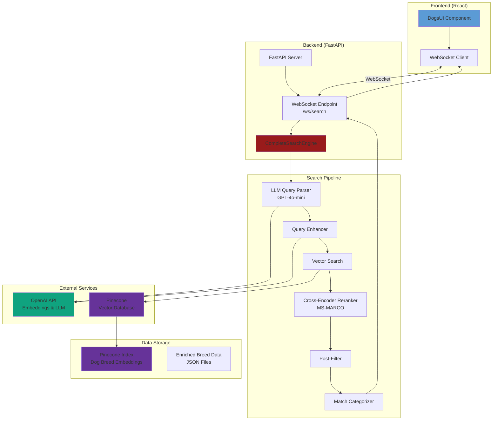
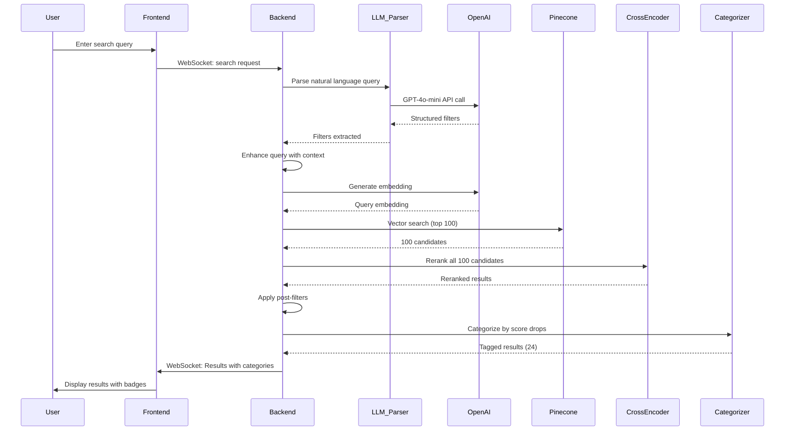
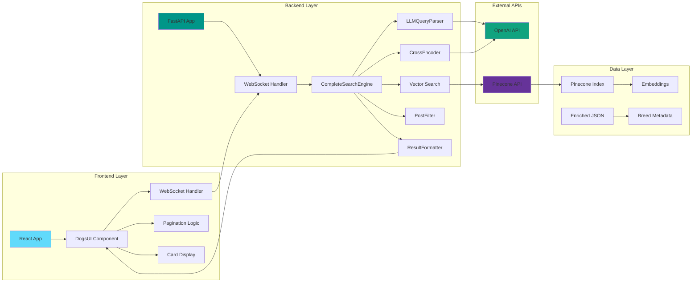
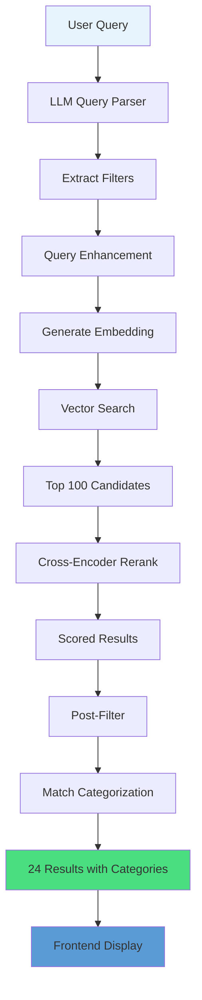

# 🏗️ Architecture Diagram

## System Architecture Overview



## Search Pipeline Flow



## Component Architecture



## Data Flow Diagram



## System Components

### Frontend Components

```
DogsUI (Main Component)
├── WebSocket Connection Manager
├── Search Input Handler
├── Results Display
│   ├── Card Grid (12 per page)
│   ├── Match Category Badges
│   └── Pagination Controls
└── Carousel (Initial Load)
```

### Backend Components

```
CompleteSearchEngine
├── LLMQueryParser
│   └── Extracts: size, weight, temperament, activity_level, etc.
├── Query Enhancer
│   └── Adds semantic context for embeddings
├── Vector Search
│   └── Pinecone query with metadata filters
├── Cross-Encoder Reranker
│   └── Scores all candidates (100)
├── Post-Filter
│   └── Applies explicit filters
└── Match Categorizer
    └── Detects score drops → Excellent/Good/Fair
```


## Search Pipeline Details

### Stage 1: Query Understanding
- **Input**: Natural language query (e.g., "small apartment dog")
- **Process**: LLM extracts structured filters
- **Output**: `{size: "small", apartment_suitable: true, ...}`

### Stage 2: Query Enhancement
- **Input**: Original query + extracted filters
- **Process**: Adds semantic context
- **Output**: Enhanced query string for embedding

### Stage 3: Embedding Generation
- **Input**: Enhanced query
- **Process**: OpenAI embedding API
- **Output**: 1536-dimensional vector

### Stage 4: Vector Search
- **Input**: Query embedding + metadata filters
- **Process**: Pinecone similarity search
- **Output**: Top 100 candidates with scores

### Stage 5: Cross-Encoder Reranking
- **Input**: 100 candidates + original query
- **Process**: Cross-encoder scores each candidate
- **Output**: Reranked results by relevance score

### Stage 6: Post-Filtering
- **Input**: Reranked results + LLM filters
- **Process**: Applies explicit filters (e.g., temperament_avoid)
- **Output**: Filtered results

### Stage 7: Categorization
- **Input**: Filtered results with scores
- **Process**: Detects drastic score drops to set boundaries
- **Output**: Results tagged as Excellent/Good/Fair

### Stage 8: Result Formatting
- **Input**: Categorized results
- **Process**: Formats for frontend display
- **Output**: 24 results with match categories


## Performance Considerations

- **Vector Search**: Retrieves top 100 candidates for better quality
- **Cross-Encoder**: Reranks all 100 candidates (not just subset)
- **Async Processing**: WebSocket with thread pool for non-blocking operations
- **Pagination**: 24 results split into 2 pages of 12 for better UX
- **Caching**: Embeddings and reranking results cached in memory

## Security

- **API Keys**: Stored in `.env` file (not committed to git)
- **CORS**: Configured for frontend domain
- **Input Validation**: Query sanitization and validation
- **Error Handling**: Comprehensive error handling with logging

