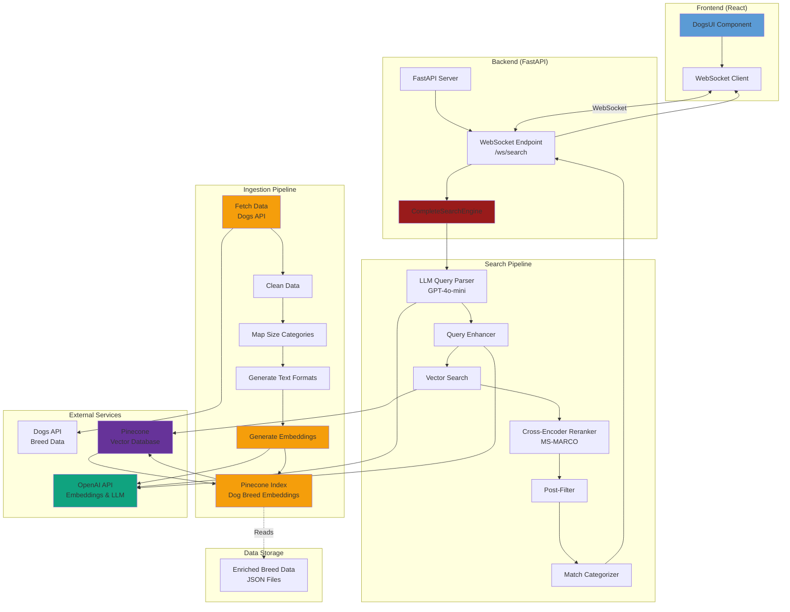
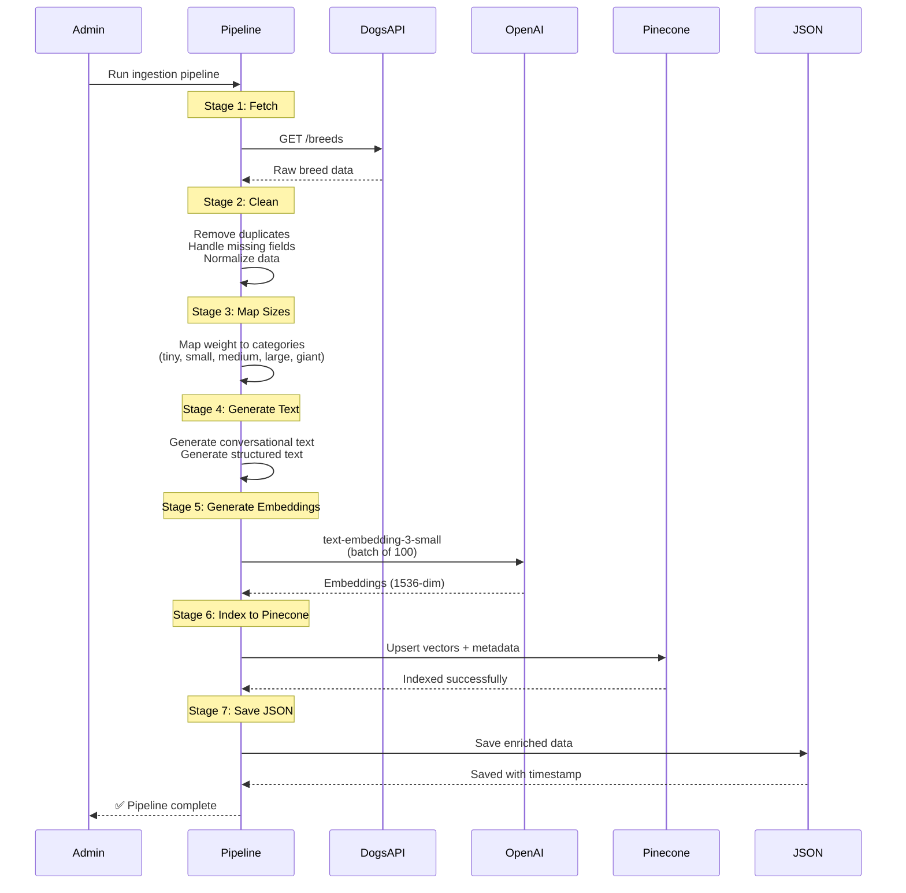
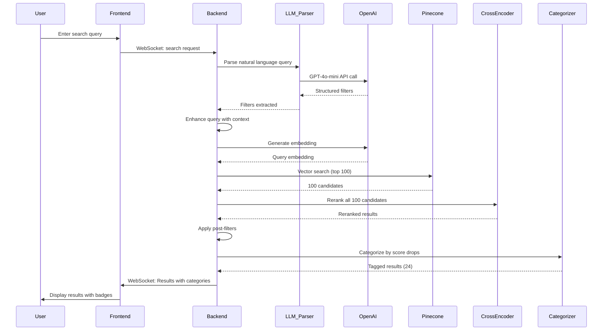
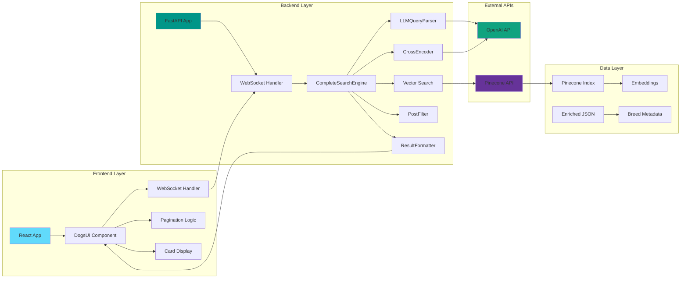
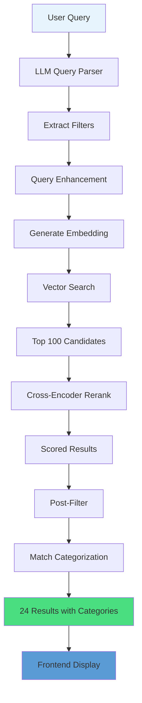

# 🏗️ Architecture Diagram

## System Architecture Overview

```mermaid
graph TB
    subgraph "Frontend (React)"
        UI[DogsUI Component]
        WS_CLIENT[WebSocket Client]
        UI --> WS_CLIENT
    end

    subgraph "Backend (FastAPI)"
        API[FastAPI Server]
        WS_ENDPOINT[WebSocket Endpoint<br/>/ws/search]
        SEARCH_ENGINE[CompleteSearchEngine]
        
        API --> WS_ENDPOINT
        WS_ENDPOINT --> SEARCH_ENGINE
    end

    subgraph "Ingestion Pipeline"
        FETCH[Fetch Data<br/>Dogs API]
        CLEAN[Clean Data]
        MAP_SIZE[Map Size Categories]
        GEN_TEXT[Generate Text Formats]
        GEN_EMBED[Generate Embeddings]
        INDEX[Index to Pinecone]
        
        FETCH --> CLEAN
        CLEAN --> MAP_SIZE
        MAP_SIZE --> GEN_TEXT
        GEN_TEXT --> GEN_EMBED
        GEN_EMBED --> INDEX
    end

    subgraph "Search Pipeline"
        LLM_PARSER[LLM Query Parser<br/>GPT-4o-mini]
        QUERY_ENHANCER[Query Enhancer]
        VECTOR_SEARCH[Vector Search]
        CROSS_ENCODER[Cross-Encoder Reranker<br/>MS-MARCO]
        POST_FILTER[Post-Filter]
        CATEGORIZER[Match Categorizer]
        
        SEARCH_ENGINE --> LLM_PARSER
        LLM_PARSER --> QUERY_ENHANCER
        QUERY_ENHANCER --> VECTOR_SEARCH
        VECTOR_SEARCH --> CROSS_ENCODER
        CROSS_ENCODER --> POST_FILTER
        POST_FILTER --> CATEGORIZER
    end

    subgraph "External Services"
        DOGS_API[Dogs API<br/>Breed Data]
        OPENAI[OpenAI API<br/>Embeddings & LLM]
        PINECONE[Pinecone<br/>Vector Database]
    end

    subgraph "Data Storage"
        INDEX[Pinecone Index<br/>Dog Breed Embeddings]
        JSON_DATA[Enriched Breed Data<br/>JSON Files]
    end

    WS_CLIENT <-->|WebSocket| WS_ENDPOINT
    FETCH --> DOGS_API
    GEN_EMBED --> OPENAI
    INDEX --> PINECONE
    LLM_PARSER --> OPENAI
    QUERY_ENHANCER --> OPENAI
    VECTOR_SEARCH --> PINECONE
    PINECONE --> INDEX
    CATEGORIZER --> WS_ENDPOINT
    WS_ENDPOINT --> WS_CLIENT
    INDEX -.->|Reads| JSON_DATA

    style UI fill:#5B9BD5
    style SEARCH_ENGINE fill:#991B1B
    style FETCH fill:#F59E0B
    style GEN_EMBED fill:#F59E0B
    style INDEX fill:#F59E0B
    style OPENAI fill:#10A37F
    style PINECONE fill:#663399
```

## Ingestion Pipeline Flow

```mermaid
sequenceDiagram
    participant Admin
    participant Pipeline
    participant DogsAPI
    participant OpenAI
    participant Pinecone
    participant JSON

    Admin->>Pipeline: Run ingestion pipeline
    
    Note over Pipeline: Stage 1: Fetch
    Pipeline->>DogsAPI: GET /breeds
    DogsAPI-->>Pipeline: Raw breed data
    
    Note over Pipeline: Stage 2: Clean
    Pipeline->>Pipeline: Remove duplicates<br/>Handle missing fields<br/>Normalize data
    
    Note over Pipeline: Stage 3: Map Sizes
    Pipeline->>Pipeline: Map weight to categories<br/>(tiny, small, medium, large, giant)
    
    Note over Pipeline: Stage 4: Generate Text
    Pipeline->>Pipeline: Generate conversational text<br/>Generate structured text
    
    Note over Pipeline: Stage 5: Generate Embeddings
    Pipeline->>OpenAI: text-embedding-3-small<br/>(batch of 100)
    OpenAI-->>Pipeline: Embeddings (1536-dim)
    
    Note over Pipeline: Stage 6: Index to Pinecone
    Pipeline->>Pinecone: Upsert vectors + metadata
    Pinecone-->>Pipeline: Indexed successfully
    
    Note over Pipeline: Stage 7: Save JSON
    Pipeline->>JSON: Save enriched data
    JSON-->>Pipeline: Saved with timestamp
    
    Pipeline-->>Admin: ✅ Pipeline complete
```

## Search Pipeline Flow

```mermaid
sequenceDiagram
    participant User
    participant Frontend
    participant Backend
    participant LLM_Parser
    participant OpenAI
    participant Pinecone
    participant CrossEncoder
    participant Categorizer

    User->>Frontend: Enter search query
    Frontend->>Backend: WebSocket: search request
    
    Backend->>LLM_Parser: Parse natural language query
    LLM_Parser->>OpenAI: GPT-4o-mini API call
    OpenAI-->>LLM_Parser: Structured filters
    LLM_Parser-->>Backend: Filters extracted
    
    Backend->>Backend: Enhance query with context
    Backend->>OpenAI: Generate embedding
    OpenAI-->>Backend: Query embedding
    
    Backend->>Pinecone: Vector search (top 100)
    Pinecone-->>Backend: 100 candidates
    
    Backend->>CrossEncoder: Rerank all 100 candidates
    CrossEncoder-->>Backend: Reranked results
    
    Backend->>Backend: Apply post-filters
    Backend->>Categorizer: Categorize by score drops
    Categorizer-->>Backend: Tagged results (24)
    
    Backend->>Frontend: WebSocket: Results with categories
    Frontend->>User: Display results with badges
```

## Component Architecture

```mermaid
graph LR
    subgraph "Frontend Layer"
        A[React App] --> B[DogsUI Component]
        B --> C[WebSocket Handler]
        B --> D[Pagination Logic]
        B --> E[Card Display]
    end

    subgraph "Backend Layer"
        F[FastAPI App] --> G[WebSocket Handler]
        G --> H[CompleteSearchEngine]
        H --> I[LLMQueryParser]
        H --> J[Vector Search]
        H --> K[CrossEncoder]
        H --> L[PostFilter]
        H --> M[ResultFormatter]
    end

    subgraph "Data Layer"
        N[Pinecone Index] --> O[Embeddings]
        P[Enriched JSON] --> Q[Breed Metadata]
    end

    subgraph "External APIs"
        R[OpenAI API]
        S[Pinecone API]
    end

    C --> G
    I --> R
    J --> S
    K --> R
    S --> N
    M --> B

    style A fill:#61DAFB
    style F fill:#009688
    style R fill:#10A37F
    style S fill:#663399
```

## Data Flow Diagram

```mermaid
flowchart TD
    START[User Query] --> PARSE[LLM Query Parser]
    PARSE --> FILTERS[Extract Filters]
    FILTERS --> ENHANCE[Query Enhancement]
    ENHANCE --> EMBED[Generate Embedding]
    EMBED --> VECTOR[Vector Search]
    VECTOR --> TOP100[Top 100 Candidates]
    TOP100 --> RERANK[Cross-Encoder Rerank]
    RERANK --> SCORED[Scored Results]
    SCORED --> FILTER[Post-Filter]
    FILTER --> CATEGORIZE[Match Categorization]
    CATEGORIZE --> RESULT[24 Results with Categories]
    RESULT --> DISPLAY[Frontend Display]

    style START fill:#E8F4FD
    style RESULT fill:#4ADE80
    style DISPLAY fill:#5B9BD5
```

