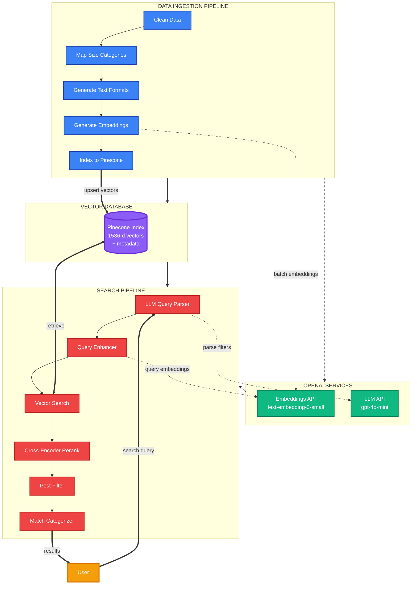

```mermaid
graph TB
    %% Styling
    classDef ingestNode fill:#3b82f6,stroke:#1e40af,stroke-width:2px,color:#fff
    classDef searchNode fill:#ef4444,stroke:#b91c1c,stroke-width:2px,color:#fff
    classDef serviceNode fill:#10b981,stroke:#047857,stroke-width:2px,color:#fff
    classDef dbNode fill:#8b5cf6,stroke:#6d28d9,stroke-width:3px,color:#fff
    classDef userNode fill:#f59e0b,stroke:#d97706,stroke-width:3px,color:#fff
    
    %% --- INGESTION PIPELINE ---
    subgraph INGEST["DATA INGESTION PIPELINE"]
        direction LR
        A1[Clean Data]:::ingestNode
        A2[Map Size Categories]:::ingestNode
        A3[Generate Text Formats]:::ingestNode
        A4[Generate Embeddings]:::ingestNode
        A5[Index to Pinecone]:::ingestNode
        
        A1 --> A2 --> A3 --> A4 --> A5
    end
    
    %% --- MIDDLE LAYER ---
    subgraph SERVICES["OPENAI SERVICES"]
        direction TB
        EMB[Embeddings API<br/>text-embedding-3-small]:::serviceNode
        LLM[LLM API<br/>gpt-4o-mini]:::serviceNode
    end
    
    subgraph DB["VECTOR DATABASE"]
        direction TB
        PC[(Pinecone Index<br/>1536-d vectors<br/>+ metadata)]:::dbNode
    end
    
    %% --- USER ---
    USER[User]:::userNode
    
    %% --- SEARCH PIPELINE ---
    subgraph SRCH["SEARCH PIPELINE"]
        direction LR
        S1[LLM Query Parser]:::searchNode
        S2[Query Enhancer]:::searchNode
        S3[Vector Search]:::searchNode
        S4[Cross-Encoder Rerank]:::searchNode
        S5[Post Filter]:::searchNode
        S6[Match Categorizer]:::searchNode
        
        S1 --> S2 --> S3 --> S4 --> S5 --> S6
    end
    
    %% --- DATA FLOWS ---
    A4 -.->|batch embeddings| EMB
    A5 ==>|upsert vectors| PC
    
    USER ==>|search query| S1
    S1 -.->|parse filters| LLM
    S2 -.->|query embeddings| EMB
    S3 <===>|retrieve| PC
    S6 ==>|results| USER
    
    %% Vertical flow
    INGEST ==> DB
    DB ==> SRCH
    INGEST -.-> SERVICES
    SERVICES -.-> SRCH
```
  

